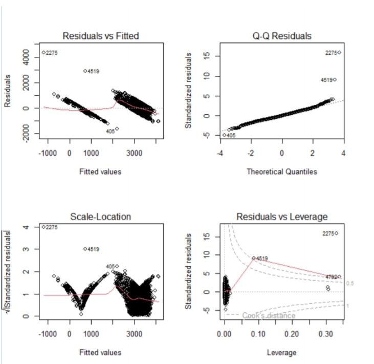
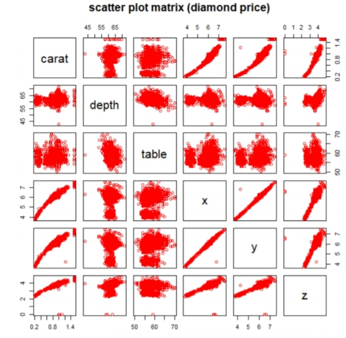
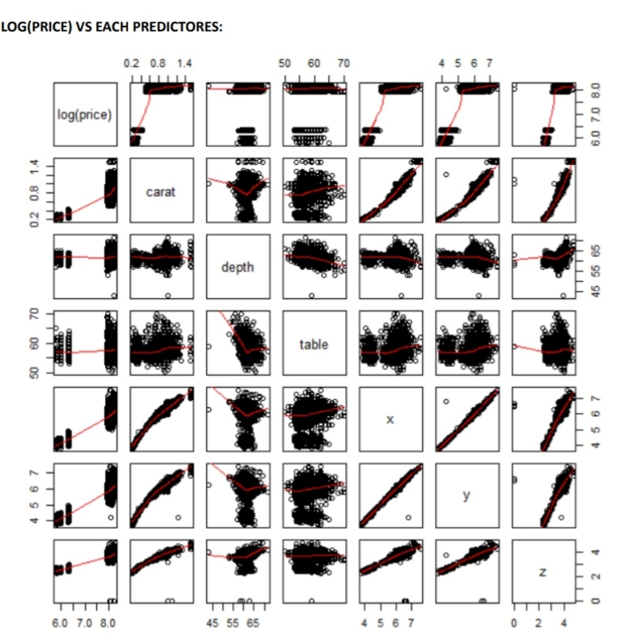

# Balaji-Data-Analytics-Portfolio
My Data Analytics Projects and Resume
# 👋 Hi, I'm Balaji

🎯 Aspiring Data Analyst | Skilled in R, Statistics & Data Visualization  

---

## 🚀 About Me
- Passionate about data analysis and insights  
- Strong foundation in statistics and analytics  
- Interested in solving real-world problems using data  

---

## 📄 Resume
👉 [Download Resume](./Balaji_Resume.pdf)

---

## 📊 Projects

### 🔹 Diamond Price Prediction (PG Project)
- Built Multiple Linear Regression model using R  
- Achieved R² = 0.90 after log transformation  
- Identified multicollinearity using VIF  
- Performed residual analysis  
👉 [View Project](./Diamond_Price_Prediction.pdf)
💻 [View Code](./Diamond_analysis.R)
### 📊 Regression Analysis Visualizations

#### 🔹 Residual Plots
Used to check model assumptions like linearity and variance  

---

#### 🔹 Scatter Plot Matrix
Used to identify relationships and multicollinearity between variables  

---

#### 🔹 Log Transformation Effect
Improved model accuracy and reduced skewness  

---

### 🔹 Music Preference Analysis (UG Project)
- Collected primary data using surveys  
- Applied Chi-square, Kruskal-Wallis, Mann-Whitney tests  
- Created bar charts and pie charts  
- Identified trends in music listening behavior  
👉 [View Project](./Music_Preference_Analysis.pdf)
💻 [View Code](./music_analysis.R)

---

## 🛠 Skills
- R Programming  
- Statistical Analysis  
- Data Visualization  
- Hypothesis Testing  
- Regression Analysis  

---

## 📫 Contact
- 📧 Email: balajisureshbalaji@gmail.com  
- 💼 LinkedIn: https://www.linkedin.com/in/balaji-s-balaji  

---

⭐ Thank you for visiting my GitHub profile!
